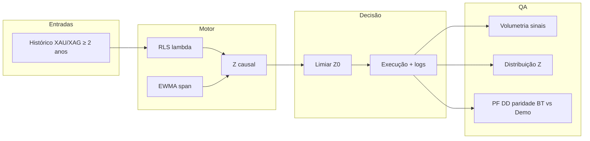

# Relatório de Convergência — Resolução OMEGA V10.4  
**Definição do problema · Evidências · Plano unificado · Opinião técnica**

| Campo | Valor |
|--------|--------|
| **Documento** | RCV-OMEGA-20260330 |
| **Versão** | 1.0 |
| **Data** | 30 de março de 2026 |
| **Âmbito** | Fecho da divergência entre auditoria independente, documentos do Conselho e necessidade operacional de “resolver agora” |
| **Base** | `AUDITORIA_TECNICA_FORENSE_OMEGA_V10_4_20260330.md`, análises em `Auditoria PARR-F/Auditoria Conselho/`, código `10_mt5_gateway_V10_4_OMNIPRESENT.py`, `online_rls_ewma.py` |

---

## 1. Sumário executivo — convergência

Todas as linhas de análise **convergem** nos seguintes pontos:

1. **O problema central não é infraestrutura (MT5, CPU, latência), mas o *fit* entre matemática do motor (RLS + EWMA causal + limiar), horizonte de negócio pretendido e critérios de aceitação.**  
2. **A governança de QA falhou ao não exigir evidência de *volumetria e geometria* do sinal** (quantos `signal_fired`, distribuição de Z, percentis) antes de homologar.  
3. **A resolução exige três frentes em paralelo:** reconciliação factual dos artefactos, **reprocessamento em histórico longo (≥ 2 anos)** com parametrização explícita, e **calibração disciplinada** (grelhas e métricas de risco), não apenas “abaixar o Z” ou “subir o λ” sem medir.  
4. **A expressão que o CEO usa — *cegueira noturna* com *parâmetros distorcidos* — é, na minha avaliação, uma boa definição operacional:** o sistema **pode estar a “ver” preços**, mas **não está a ver o mesmo regime estatístico** que a narrativa de mean-reversion assume, ou os limiares estão **desalinhados** da distribuição real do Z.

---

## 2. Sobre a sua definição: “cegueira noturna” e parâmetros distorcidos

**Opinião (alta concordância):**

- **Cegueira noturna** captura bem o sintoma: **dados chegam**, o motor **roda**, mas **a decisão útil** (entrada/saída alinhada ao edge pretendido) **não emerge** — seja porque o spread é **reabsorvido** demasiado depressa pelo RLS, seja porque o denominador do Z **não reflete** a escala de anomalia que o utilizador espera, seja porque o **limiar é incompatível** com a cauda empírica de |Z|.  
- **Parâmetros totalmente distorcidos** é uma formulação forte mas **defensável** no sentido de **engenharia**: *distorção* aqui significa **combinação (λ, span, Z₀) escolhida sem ancora na distribuição empírica do Z e sem objetivo de negócio quantificado* (frequência de trades, PF, DD máximo). Não implica “erro de código”, implica **erro de calibração e de processo**.

**Nuance indispensável:** distorção **não** se corrige só por intuição; corrige-se por **histórico completo + métricas acordadas + gates de QA**.

---

## 3. Onde as análises divergiram — e como fechamos

| Tese | Origem | Estado na convergência |
|------|--------|-------------------------|
| “Stress 2Y teve **zero** `signal_fired`” | Vários docs do Conselho | **Não sustentada** nos CSVs `STRESS_2Y_*.csv` medidos em `evidencia_pre_demo/02_logs_execucao/` (**402 / 197 / 375** sinais por perfil, 100k linhas cada). **Obrigatório:** reconciliar (mesmo ficheiro? mesma corrida? coluna correta?) e registar **hash + commit + comando** de geração. |
| “λ curto + span longo + Z alto ⇒ sistema mudo ou Z comprimido” | Auditoria + COO + narrativa técnica | **Convergência forte:** hipótese **plausível** e **a testar** em grelha; não substitui a reconciliação acima. |
| “Baixar Z para 2,0 e subir λ para 0,9998 já resolve” | CQO / CKO | **Convergência parcial:** direção possível, **risco** de overtrading e de mudança de regime sem **curva PF/DD**. Deve ser **resultado** de grelha, não **premissa** única. |
| “Medir geometria do Z antes de mudar estratégia” | COO | **Convergência total:** adotar como **princípio** do plano. |

---

## 4. Arquitetura do problema (visão unificada)

**Mensagem:** a “cegueira” aparece quando **Z e T** não estão calibrados para o **H** e para o **objetivo de trading**, mesmo com código estável.

---

## 5. Plano de resolução — fases (resolver *agora*, sem atalho irresponsável)

### Fase A — Hoje (bloqueante, baixo risco)

| # | Ação | Critério de saída |
|---|------|-------------------|
| A1 | **Inventário único** dos CSVs de stress e demo: caminho, data, `git rev-parse HEAD`, SHA3 dos ficheiros usados no conselho | Tabela única “artefacto → hash → origem” |
| A2 | **Script único** de auditoria (contagem `signal_fired`, percentis de `z`, linhas patológicas \|z\| > limite) | Mesmo script para stress e demo |
| A3 | **Fechar** a contradição “0 vs centenas” com evidência (não com debate) | Nota escrita: *incidente de custódia* ou *relatório desatualizado* |

### Fase B — Histórico completo ≥ 2 anos (o seu mandato)

| # | Ação | Critério de saída |
|---|------|-------------------|
| B1 | Garantir **par XAUUSD / XAGUSD** alinhado no tempo (merge auditável), **sem gaps não documentados** | Dataset versionado + nota de qualidade |
| B2 | Correr **stress/replay** no mesmo pipeline do gateway (ou script batch equivalente) sobre **todo** o histórico disponível (não só 100k se o objetivo for 2Y completos) | CSV por perfil + manifesto |
| B3 | Para **cada** perfil, registar: taxa de sinal, distribuição de Z, % barras com \|Z\| ≥ Z₀, e métricas de PnL simulado se aplicável | Relatório numérico anexo |

### Fase C — Correções de parâmetros (anti-cegueira)

| # | Ação | Nota |
|---|------|------|
| C1 | **Grelha de λ** (ex.: 0,960 → 0,985 → 0,995 → 0,999 → 0,9998) | Medir sinais, PF, DD por célula |
| C2 | **Grelha de limiar** \|Z\| (ex.: 1,5 … 3,75) | Idem |
| C3 | **Grelha de `ewma_span`** em coerência com λ | COO: evitar “conserto cego” |
| C4 | Política de **sanidade numérica** (warm-up, clip de Z extremo, revisão da linha com \|z\| patológica) | Já identificado nos stress files |

**Convergência:** a “correção necessária” **não** é um único ponto mágico; é o **melhor compromisso** na grelha, dado **histórico longo** e **restrições de risco**.

### Fase D — QA mandatório (impedir nova homologação cega)

- Falha de pipeline se: `signal_fired.sum() == 0` **no dataset de referência** **ou** percentis de Z incompatíveis com o Z₀ escolhido (ex.: P95(\|Z\|) < Z₀ de forma estrutural).  
- **Paridade:** comparar distribuição de Z **stress vs demo** (mesma versão, mesmos parâmetros); divergência grande ⇒ investigar *merge*, sessão, ou feed — não culpar só o “mercado calmo”.

### Fase E — Demo controlada

- Só após **B + C mínimos + D** passarem.  
- Duração e critérios de sucesso **escritos** (ex.: registo de pelo menos N sinais em janela T **se** o movimento de preço exceder limiar Y — definir Y com base no histórico, não ad hoc).

---

## 6. Riscos se “resolver agora” for só mudar números

| Risco | Mitigação |
|-------|-----------|
| Z₀ baixo ⇒ **ruído** e overtrading | Grelha + limite de frequência + DD máximo |
| λ alto ⇒ **β lento** e atraso em regimes que mudam | Comparar com Rolling OLS / Kalman (fase opcional COO) |
| Histórico **sem** reconciliação ⇒ decisões sobre **ficheiro errado** | Fase A obrigatória |
| Sucesso em backtest **≠** demo | Fase D paridade + mesma versão commitada |

---

## 7. Opinião direta sobre a sua proposta

**Concordo** que:

1. **É preciso resolver com urgência** — mas urgência **com disciplina de evidência**, senão repete-se o ciclo “narrativa soberana vs dados”.  
2. **Rodar com histórico completo de 2 ou mais anos** é **condição necessária** para calibrar λ, span e Z₀ com **honestidade estatística**; 100k barras podem ser amostra, mas o **mandato de negócio** que descreveu é **população longa** — o pipeline deve suportá-la e versioná-la.  
3. **“Cegueira noturna” + “parâmetros distorcidos”** são **definições úteis** para alinhar o Conselho: o problema é **de calibração e de processo**, não só de “bugs”.

**Acrescento** (para não haver falsa convergência): até esclarecer o **zero vs centenas** nos stress CSVs, qualquer frase do tipo “o backtest provou silêncio total” deve ser **evitada** em ata oficiais; substituir por **“medição atual nos artefactos X: N sinais; discrepância com relatório Y sob investigação”**.

---

## 8. Próximo passo imediato (sugestão)

1. Aprovar este documento como **plano único de convergência**.  
2. Executar **Fase A** no mesmo dia.  
3. Em paralelo, preparar **dataset 2Y+** e job de **Fase B** (pode demorar mais que “duas horas” em CPU — o prazo real deve ser **engenharia**, não slogans).  
4. Só então **congelar** candidato V10.5 (ou nome que adoptarem) com **parâmetros** extraídos da **grelha** e **QA** passando.

---

**Fim do relatório RCV-OMEGA-20260330**

*Este texto consolida a auditoria ATF, as contribuições do Conselho (com divergências explícitas tratadas na secção 3) e a orientação estratégica do CEO, num único plano executável.*
