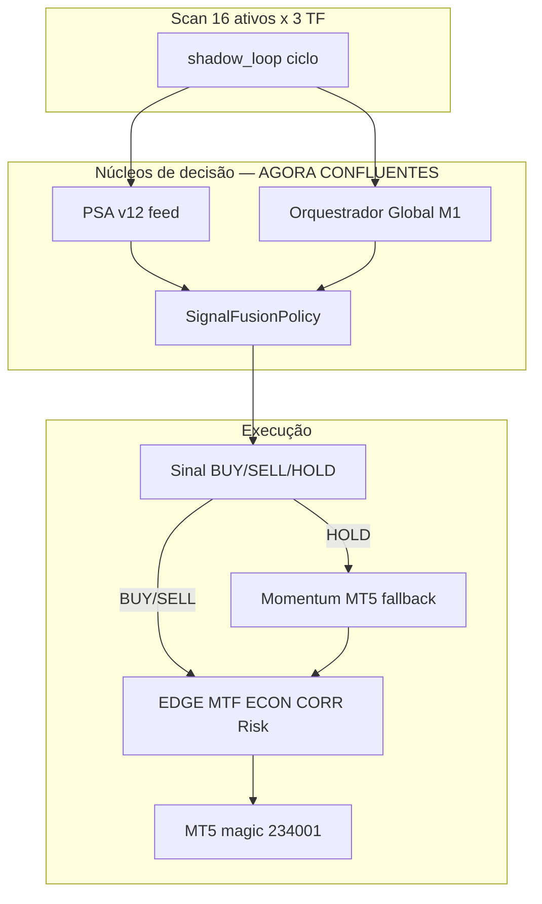

# CEO — Ecossistema unificado (um sistema, não motores em conflito)

| Campo | Valor |
|-------|--------|
| **Data** | 2026-05-25 |
| **Estado** | **IMPLEMENTADO** — requer reinício runner |
| **Commit** | (após push) branch `feat/execution-router-atr-20260523` |

---

## 1. Estava resolvido ou não?

| Área | Antes | Agora |
|------|-------|-------|
| P0 Router / schedule / magic | ✅ | ✅ |
| **Motores de decisão alinhados** | ❌ **Não** | ✅ **Pacote unificado** |
| IA = bússola (não só vento/momentum) | ❌ | ✅ **Fusão PSA+OMEGA live** |
| max_positions IA=2 vs runner=8 | ❌ Conflito | ✅ **8 em todo o ecossistema** |
| Portfolio IA=7 vs runner=16 | ❌ Conflito | ✅ **16 em todas as sessões** |
| Log HOLD sem motivo | ❌ | ✅ **reason + fusion no log** |

**Resposta CEO:** O DEMO **corria**, mas **não estava integrado como um único ecossistema**. Agora há **uma fonte de verdade** (`OMEGA_ECOSYSTEM_UNIFIED=1`).

---

## 2. Os “motores” — mapa honesto (não são bugs, eram camadas desalinhadas)



| Núcleo | Papel | Antes | Depois (unified) |
|--------|-------|-------|------------------|
| **PSA v12** | Sinal por ativo/TF (skills) | BUY no log, ignorado | Entra na **fusão** |
| **Orquestrador** | Estratégias + sessão | HOLD (7 ativos, max 2) | **16 ativos, max 8** |
| **Fusão** | Confluência PSA+OMEGA | OFF ou shadow (mata PSA) | **ON, PSA_SHADOW=0** |
| **Momentum** | Fallback se IA=HOLD | Única via de entrada | **Reserva**, não bússola |
| **Risk gates** | Protecção capital | Activo | Activo |

**Bússola = Fusão + Orquestrador + PSA alinhados.**  
**Vento = momentum** — só quando os três concordam HOLD ou fusão abaixo de confiança.

---

## 3. O que foi implementado (ficheiros)

| Ficheiro | Alteração |
|----------|-----------|
| `modules/omega_ecosystem_unified.py` | Fonte única portfolio + max_positions + manifest |
| `agent_ia/core/omega_session_calibrator.py` | 16 ativos + max_pos em **todas** as sessões |
| `agent_ia/core/omega_global_orchestrator.py` | Portfolio unificado + limite 8 |
| `agent_ia/integration/shadow_loop_integration.py` | Fusão auto com unified |
| `core_engines/shadow_loop.py` | Log `reason` + manifest audit |
| `scripts/run_omega_24x7.ps1` | Envs unificados |

**Envs activos no runner:**

```
OMEGA_ECOSYSTEM_UNIFIED=1
OMEGA_USE_SIGNAL_FUSION=1
PSA_SHADOW_MODE=0
FUSION_MIN_CONFIDENCE=0.55
OMEGA_LOOP_PSA_V12=1
```

---

## 4. Reinício obrigatório CEO/PSA

```powershell
# Parar runner actual (CTRL+C ou Stop-Process)
cd C:\OMEGA_QUANTUM_LAB\SOURCE_CODE
git pull origin feat/execution-router-atr-20260523
& .\scripts\run_omega_24x7.ps1
```

**Validar no log:**

- `[ECOSYSTEM_UNIFIED] manifesto=...ecosystem_unified_manifest.json`
- `[IA] Sinal rejeitado: ... | reason=... | fusion=...`
- `[IA] Sinal aprovado` ou `FASE4 DECISION=AGENT_IA` / `source=AGENT_IA`
- `audit/paper/ecosystem_unified_manifest.json` com 16 ativos e max_positions=8

---

## 5. O que continua a filtrar (propositado — risk manager)

Mesmo unificado, **não** é “ordem por segundo”:

- EDGE_GATE, MTF_BIAS, ECON_GATE, CORR, KS, DD

Isso é **integridade**, não conflito entre motores.

---

## 6. PSA — não reverter

Não remover `OMEGA_ECOSYSTEM_UNIFIED` nem repor listas de 7 ativos / max_positions=2 no calibrador.

---

*CEO ecossistema unificado — AIC 2026-05-25*
